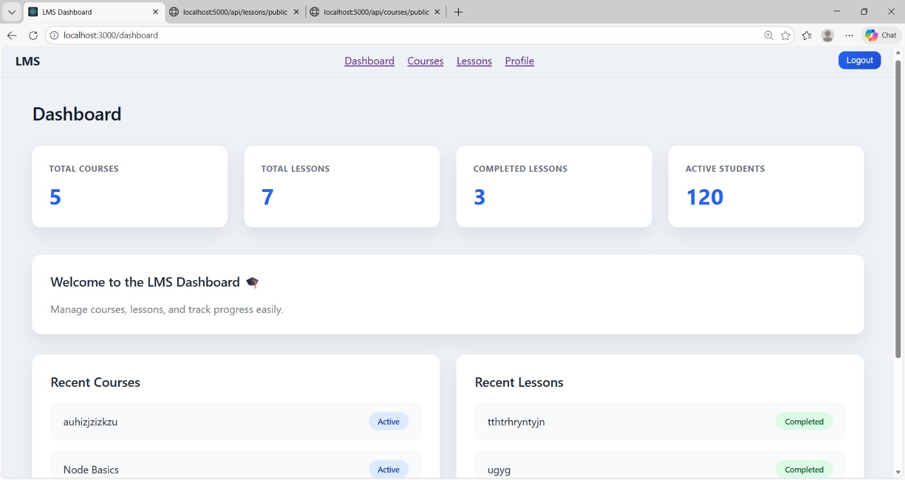
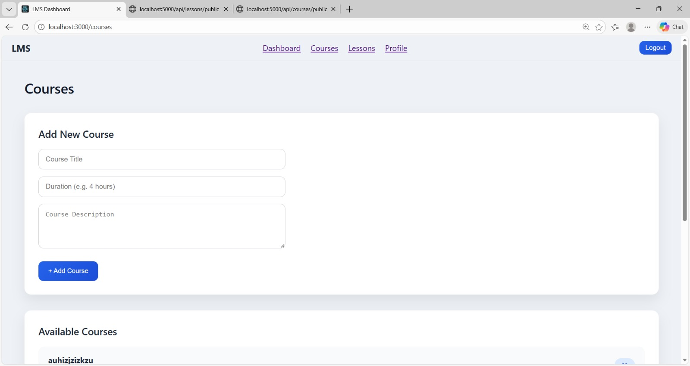
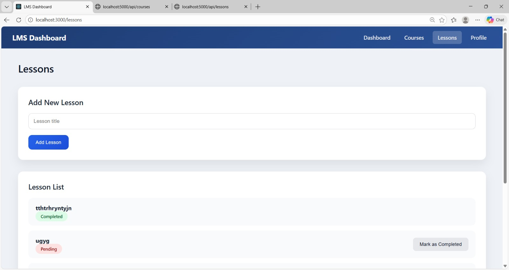
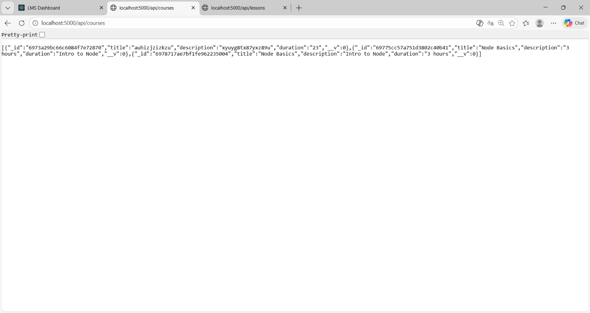
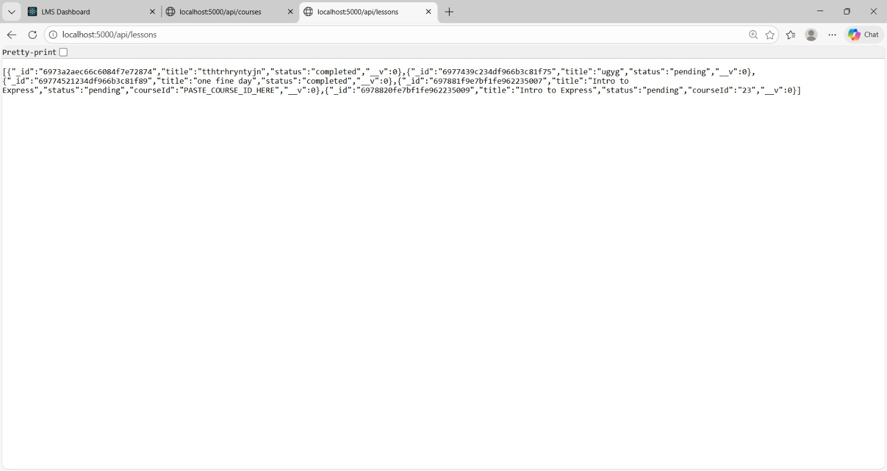
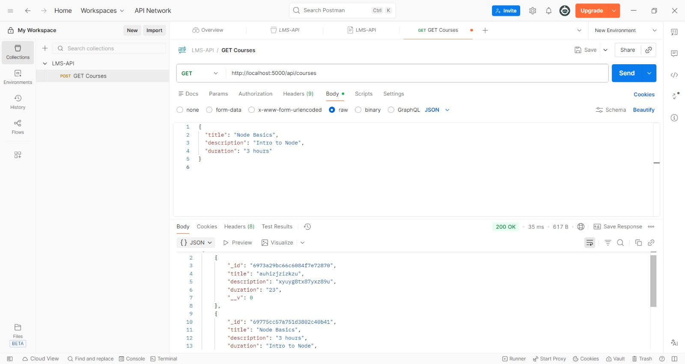
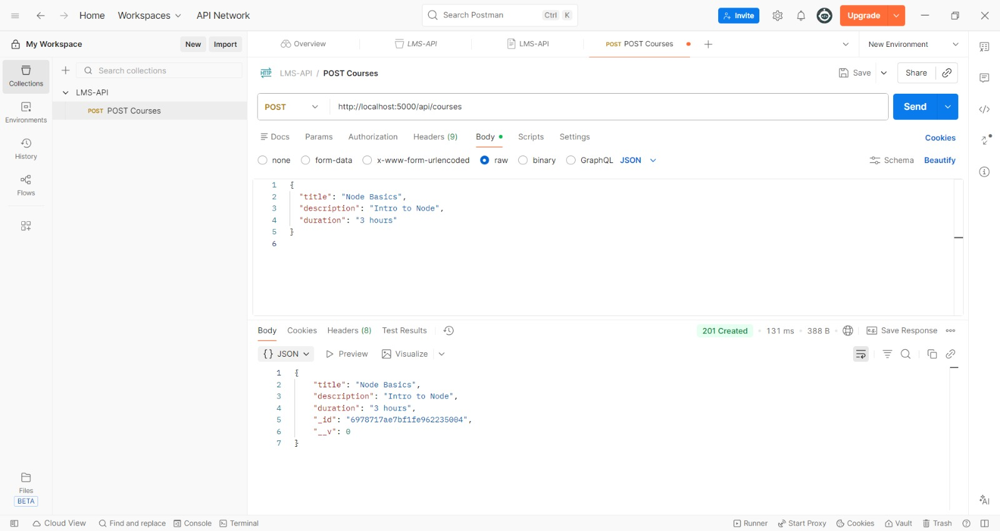
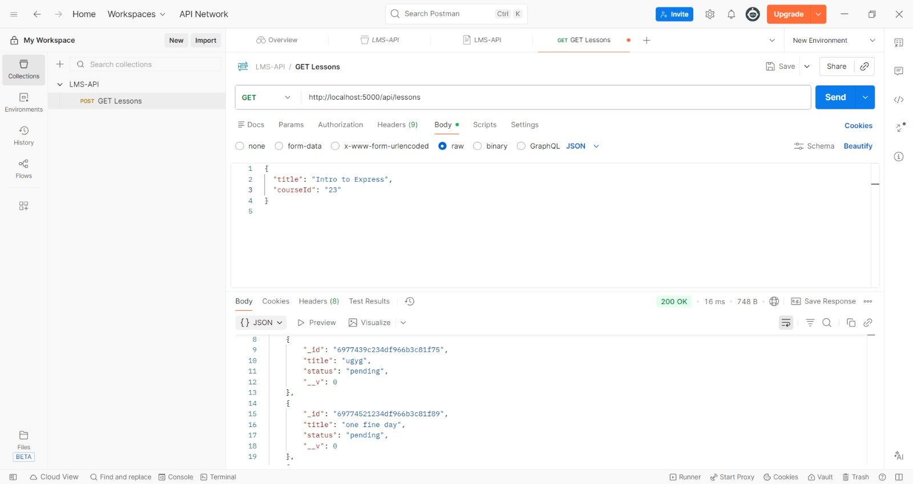
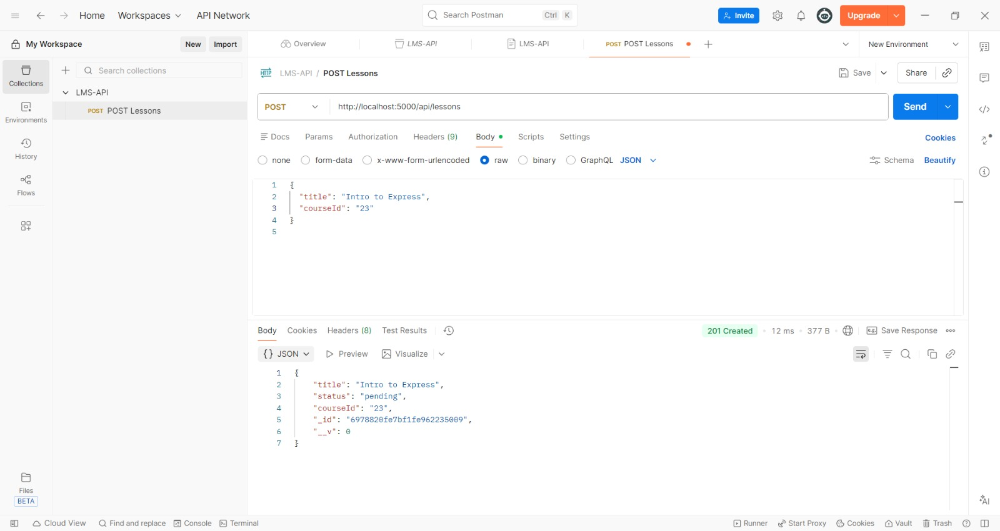
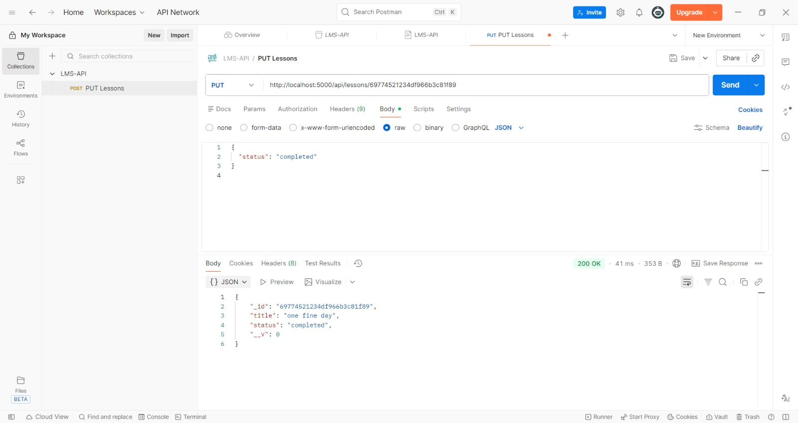

# LMS Dashboard (MERN)

## Features
- Add & view courses
- Add & view lessons
- Mark lessons as completed
- Dashboard stats

## APIs
- POST /api/courses
- GET /api/courses
- POST /api/lessons
- GET /api/lessons
- PUT /api/lessons/:id

## Screenshots & API Proof

### Frontend Screens

#### Dashboard Page

#### Courses Page

#### Lessons Page

---

### Backend Screens

#### Courses Backend Running

#### Lessons Backend Running

---

### API Testing Proof

#### GET Courses

#### POST Courses

#### GET Lessons

#### POST Lessons

#### PUT Lessons

## Tech Stack
- React
- Node.js
- Express
- MongoDB

## How to Run
### Backend
npm install  
npm start

### Frontend
npm install  
npm start
